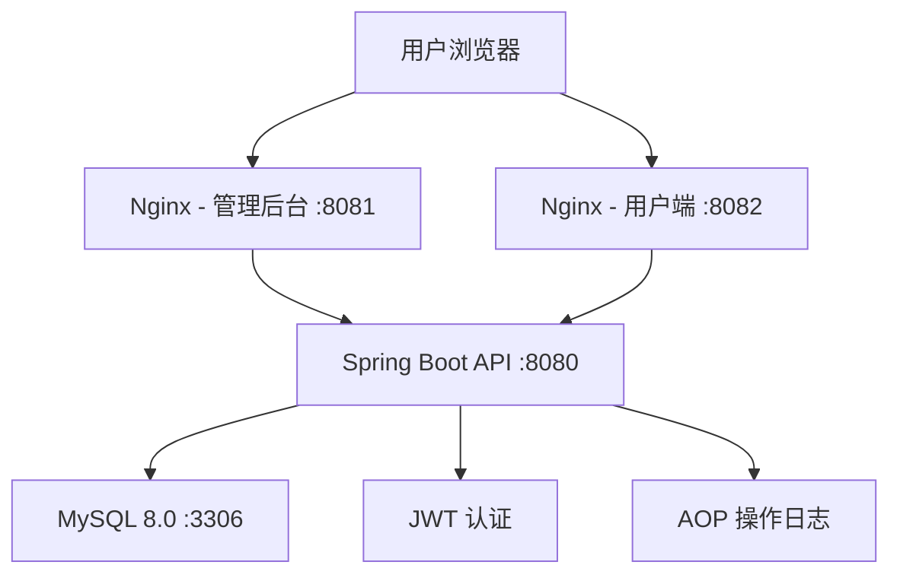
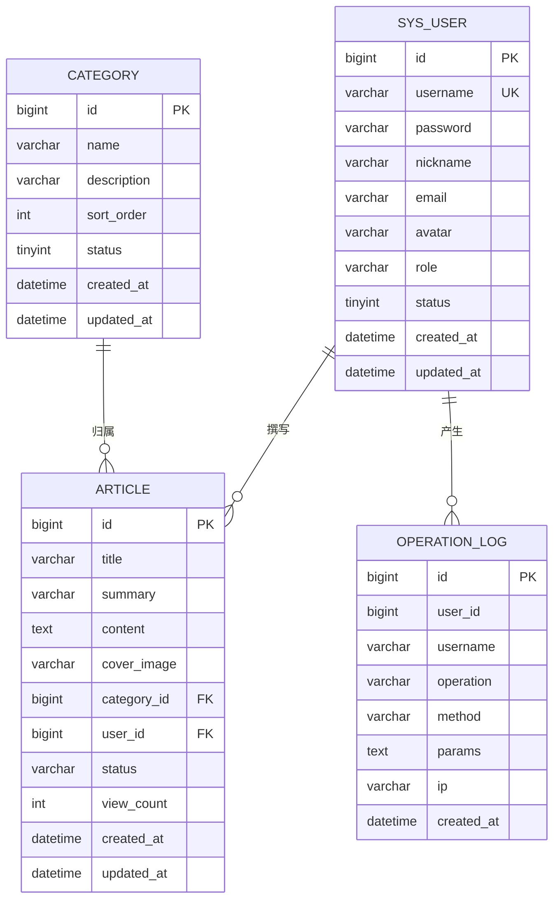

# 个人博客系统 - 项目设计文档

## 系统架构

## ER 图

## 接口清单

### AuthController (`/api/auth`)
| 方法 | 路径 | 说明 | 认证 |
|------|------|------|------|
| POST | /login | 用户登录 | 否 |
| POST | /register | 用户注册（用户名/昵称不可重复，邮箱格式校验） | 否 |
| GET | /info | 获取当前用户信息 | 是 |
| POST | /logout | 用户退出 | 是 |

### ArticleController (`/api/admin/article`)
| 方法 | 路径 | 说明 | 认证 |
|------|------|------|------|
| GET | /list | 文章列表（分页） | 是 |
| GET | /{id} | 文章详情 | 是 |
| POST | /save | 创建/更新文章 | 是 |
| DELETE | /{id} | 删除文章 | 是 |
| PUT | /{id}/status | 更新文章状态 | 是 |

### CategoryController (`/api/admin/category`)
| 方法 | 路径 | 说明 | 认证 |
|------|------|------|------|
| GET | /list | 分类列表 | 是 |
| POST | /save | 创建/更新分类 | 是 |
| DELETE | /{id} | 删除分类 | 是 |

### UserController (`/api/admin/user`)
| 方法 | 路径 | 说明 | 认证 |
|------|------|------|------|
| GET | /list | 用户列表（分页） | 是 |
| PUT | /{id}/status | 启用/禁用用户 | 是 |
| GET | /profile | 获取个人信息 | 是 |
| PUT | /profile | 更新个人信息 | 是 |

### OperationLogController (`/api/admin/log`)
| 方法 | 路径 | 说明 | 认证 |
|------|------|------|------|
| GET | /list | 操作日志列表（分页） | 是 |

### PublicController (`/api/public`)
| 方法 | 路径 | 说明 | 认证 |
|------|------|------|------|
| GET | /articles | 已发布文章列表 | 否 |
| GET | /articles/{id} | 文章详情 | 否 |
| GET | /categories | 分类列表 | 否 |

## UI/UX 规范

| 属性 | 值 |
|------|------|
| 主色调 | #667eea (管理端) / #2d8cf0 (用户端) |
| 辅助色 | #764ba2 |
| 背景色 | #f5f7fa |
| 卡片背景 | #ffffff |
| 文字主色 | #303133 |
| 文字辅色 | #909399 |
| 卡片圆角 | 12px |
| 基础间距 | 8px / 16px / 24px |
| 字体 | -apple-system, BlinkMacSystemFont, "Segoe UI", Roboto, "Helvetica Neue", Arial, sans-serif |
